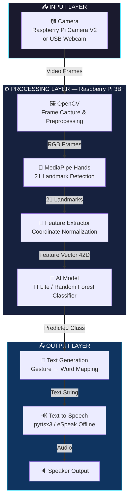
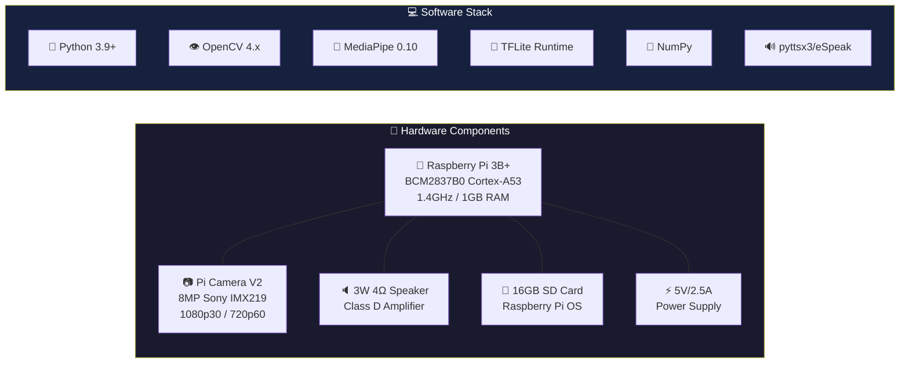
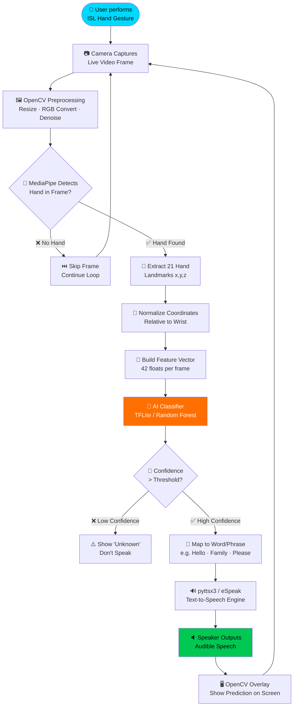
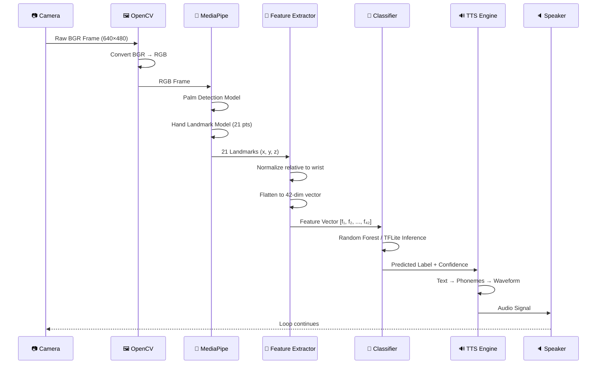
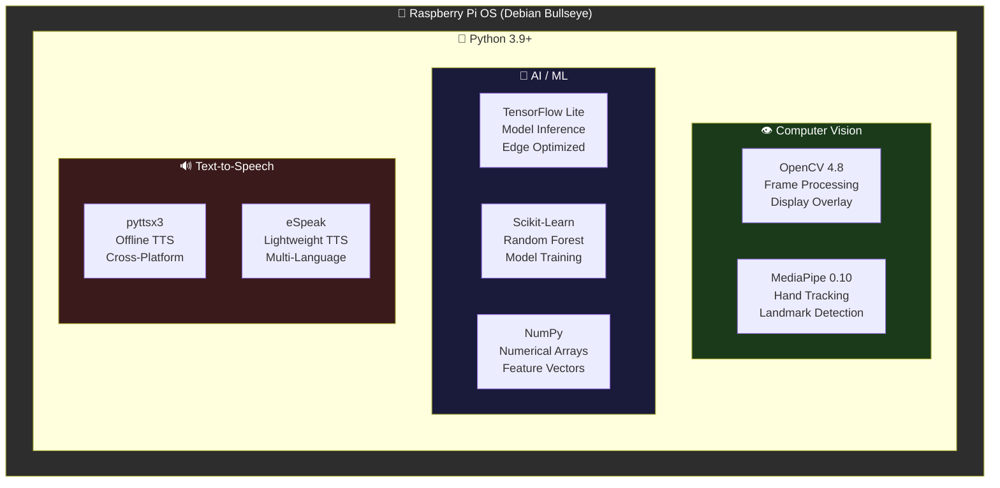
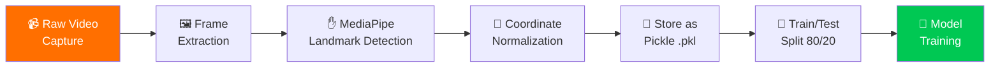
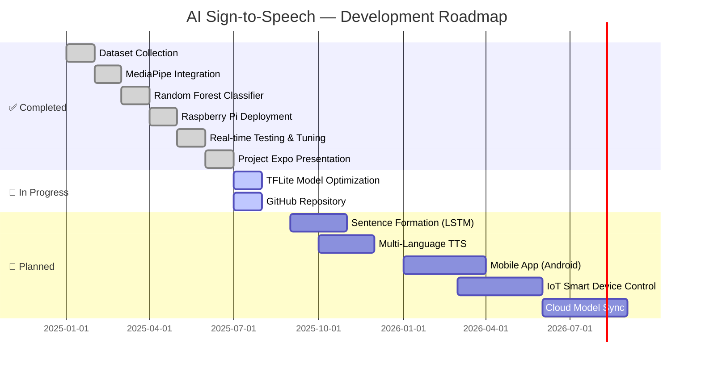

<div align="center">

<!-- ANIMATED HERO BANNER -->


<!-- ANIMATED TYPING EFFECT -->
<a href="https://git.io/typing-svg">
  
</a>

<br/>

<!-- VISITOR COUNTER -->


<br/><br/>

<!-- BADGES ROW 1 -->


<br/>

<!-- BADGES ROW 2 -->


<br/>

<!-- BADGES ROW 3 -->


</div>

---

<div align="center">

## 🌟 Project at a Glance

| 🎯 Purpose | 🖥️ Platform | 🧠 AI Model | 🔊 Output |
|:---:|:---:|:---:|:---:|
| ISL → Speech Conversion | Raspberry Pi 3B+ | TFLite + Random Forest | Offline TTS |
| **Accuracy** | **FPS** | **Latency** | **Mode** |
| ~93% | 15-20 FPS | <200ms | Fully Offline |

</div>

---

## 📋 Table of Contents

<details open>
<summary><b>Click to expand / collapse</b></summary>

- [🌟 Project Overview](#-project-overview)
- [🎯 Problem Statement](#-problem-statement)
- [🚀 Features](#-features)
- [🏗️ System Architecture](#%EF%B8%8F-system-architecture)
- [🔄 Complete Workflow](#-complete-workflow)
- [🤖 AI Pipeline](#-ai-pipeline)
- [🖥️ Hardware Setup](#%EF%B8%8F-hardware-setup)
- [💻 Software Stack](#-software-stack)
- [📊 Dataset & Preprocessing](#-dataset--preprocessing)
- [🧠 Model Details](#-model-details)
- [📸 Screenshots & Demo](#-screenshots--demo)
- [⚡ Quick Start](#-quick-start)
- [🔧 Installation Guide](#-installation-guide)
- [▶️ Running the Project](#%EF%B8%8F-running-the-project)
- [📈 Performance Metrics](#-performance-metrics)
- [📁 Project Structure](#-project-structure)
- [🗺️ Roadmap](#%EF%B8%8F-roadmap)
- [🤝 Contributing](#-contributing)
- [📜 License](#-license)
- [👤 Author](#-author)
- [📚 References](#-references)

</details>

---

## 🌟 Project Overview

<div align="center">

> *"Empowering the deaf and speech-impaired community through real-time AI"*

</div>

**AI-Powered Sign-to-Speech Conversion** is a fully embedded, offline AI system built on **Raspberry Pi 3B+** that translates **Indian Sign Language (ISL)** hand gestures into **audible speech** in real time — no cloud, no internet, no interpreters needed.

The system uses **MediaPipe Hands** to extract 21 3D hand landmarks from camera input, feeds them into a **TensorFlow Lite / Random Forest classifier** trained on custom ISL gesture data, and converts predictions to natural speech using **pyttsx3/eSpeak**.

<div align="center">

| Target Users | Use Cases |
|:---|:---|
| 🏥 Hearing-impaired individuals | Hospital communication |
| 🗣️ Speech-impaired individuals | School accessibility |
| 🏫 Special education teachers | Public service centers |
| 👨‍💻 Assistive technology researchers | Smart home interaction |

</div>

---

## 🎯 Problem Statement

<table>
<tr>
<td width="50%">

### ❌ The Challenge
- **63 million** hearing-impaired people in India alone
- Sign language is unknown to most of the general public
- **Lack of interpreters** in hospitals, schools, and public offices
- Existing solutions are either expensive glove-based hardware or require cloud connectivity
- Communication barrier leads to **social isolation** and limited opportunities

</td>
<td width="50%">

### ✅ Our Solution
- **Camera-based** — no special hardware gloves needed
- **Fully offline** — works without internet
- **Portable** — runs on a ₹3,000 Raspberry Pi
- **Real-time** — <200ms gesture-to-speech latency
- **Open-source** — freely available for everyone

</td>
</tr>
</table>

---

## 🚀 Features

<div align="center">

```
┌─────────────────────────────────────────────────────────────────┐
│                    🌟 CORE FEATURES                              │
├─────────────────────┬───────────────────────────────────────────┤
│ 🤖 Real-time AI     │ Live gesture recognition at 15-20 FPS     │
│ 🔌 Fully Offline    │ No internet or cloud required             │
│ ⚡ Low Latency      │ End-to-end <200ms response time           │
│ 📦 Portable         │ Runs on Raspberry Pi 3B+                  │
│ 🎯 High Accuracy    │ ~93% gesture recognition accuracy         │
│ 🔊 Natural Speech   │ eSpeak/pyttsx3 offline TTS                │
│ 🖐️ 21 Landmarks     │ Full hand skeleton tracking               │
│ 📷 Any Camera       │ Works with USB cam or Pi Camera           │
│ 🪶 Lightweight      │ <5MB TFLite model footprint               │
│ 🔧 Modular Code     │ Easy to extend and customize              │
└─────────────────────┴───────────────────────────────────────────┘
```

</div>

---

## 🏗️ System Architecture



---



---

## 🔄 Complete Workflow



---

## 🤖 AI Pipeline

### MediaPipe Hand Landmark Detection



### The 21 Hand Landmarks

```
                    8   12  16  20
                    |   |   |   |
                7   11  15  19
                |   |   |   |
            6   10  14  18
            |   |   |   |
        5   9   13  17
        |   |   |   |
    4   3   2   1   0(WRIST)
    |
  THUMB
  
  0: WRIST          11: MIDDLE_FINGER_DIP
  1: THUMB_CMC      12: MIDDLE_FINGER_TIP
  2: THUMB_MCP      13: RING_FINGER_MCP
  3: THUMB_IP       14: RING_FINGER_PIP
  4: THUMB_TIP      15: RING_FINGER_DIP
  5: INDEX_MCP      16: RING_FINGER_TIP
  6: INDEX_PIP      17: PINKY_MCP
  7: INDEX_DIP      18: PINKY_PIP
  8: INDEX_TIP      19: PINKY_DIP
  9: MIDDLE_MCP     20: PINKY_TIP
 10: MIDDLE_PIP
```

---

## 🖥️ Hardware Setup

<div align="center">

| Component | Specification | Purpose |
|:---:|:---:|:---:|
|  | BCM2837B0 · 1.4GHz · 1GB RAM | Main processing unit |
| 📷 Pi Camera V2 | 8MP Sony IMX219 · 1080p30 | Hand gesture capture |
| 🔈 Speaker | 3W · 4Ω · Class D Amp | Speech audio output |
| 💾 MicroSD Card | 16GB SanDisk Ultra | OS + project files |
| ⚡ Power Supply | 5V / 2.5A Micro-USB | Stable power delivery |
| 🖥️ HDMI Monitor | Optional · Any HDMI | Display predictions |

</div>

### Hardware Connection Diagram

```
┌─────────────────────────────────────────────────────┐
│                  RASPBERRY PI 3B+                    │
│                                                      │
│  ┌──────────┐    ┌──────────────────────────────┐   │
│  │ CSI Port ├────┤   Pi Camera Module V2        │   │
│  └──────────┘    │   (Ribbon Cable Connection)  │   │
│                  └──────────────────────────────┘   │
│  ┌──────────┐    ┌──────────────────────────────┐   │
│  │  USB 2.0 ├────┤   USB Webcam (Alternative)   │   │
│  └──────────┘    └──────────────────────────────┘   │
│  ┌──────────┐    ┌──────────────────────────────┐   │
│  │3.5mm Jack├────┤   Speaker + Amplifier        │   │
│  └──────────┘    └──────────────────────────────┘   │
│  ┌──────────┐    ┌──────────────────────────────┐   │
│  │   HDMI   ├────┤   Monitor (Optional)         │   │
│  └──────────┘    └──────────────────────────────┘   │
│  ┌──────────┐    ┌──────────────────────────────┐   │
│  │MicroUSB  ├────┤   5V/2.5A Power Supply       │   │
│  └──────────┘    └──────────────────────────────┘   │
└─────────────────────────────────────────────────────┘
```

### 📸 Hardware Photos

<table>
<tr>
<td align="center" width="50%">

**Raspberry Pi 3 Model B+**


*BCM2837B0 · 1.4GHz Quad-Core · 1GB LPDDR2*

</td>
<td align="center" width="50%">

**Pi Camera Module V2**


*8MP Sony IMX219 · Direct CSI Connection*

</td>
</tr>
</table>

---

## 💻 Software Stack



---

## 📊 Dataset & Preprocessing

<details>
<summary><b>🗂️ Click to expand Dataset Details</b></summary>

### Dataset Overview

| Property | Value |
|:---|:---|
| Type | Custom ISL Gesture Dataset |
| Collection Method | Webcam + Pi Camera |
| Gestures Supported | Hello, Goodbye, Please, Thank You, Yes, No, Help, Family, School, Water |
| Samples per Gesture | 100–200 images |
| Total Samples | ~1,500 gesture samples |
| Format | Pickle files (.pkl) containing landmark arrays |
| Landmark Features | 42 float values (21 landmarks × x,y coordinates) |

### Preprocessing Pipeline



### Data Augmentation

- **Horizontal Flipping** — handles both left and right hands
- **Brightness Variation** — 0.7x to 1.3x brightness range
- **Rotation** — ±15° rotation tolerance
- **Scale Variation** — 0.9x to 1.1x hand size variation

</details>

---

## 🧠 Model Details

<details>
<summary><b>🔬 Click to expand Model Architecture</b></summary>

### Classifier Architecture

```
Input Layer:  [42 features] — 21 landmarks × (x,y)
      ↓
Random Forest Classifier
  ├── 100 Decision Trees
  ├── Max Depth: 20
  ├── Min Samples Split: 2
  ├── Feature Sampling: sqrt(n_features)
  └── Voting: Majority Vote

Output Layer: [N classes] — One per gesture label
```

### TensorFlow Lite Model (Alternative)

```
Input:  (1, 42)  ← 42-dim feature vector
  → Dense(128, ReLU) + BatchNorm + Dropout(0.3)
  → Dense(64, ReLU)  + BatchNorm + Dropout(0.2)
  → Dense(N, Softmax) ← N = number of gestures

Model Size:    ~2.3 MB (.tflite)
Inference:     <50ms on Raspberry Pi 3B+
Memory Usage:  ~120MB RAM during inference
```

### Performance Summary

| Metric | Value |
|:---|:---|
| Gesture Recognition Accuracy | **~93%** |
| Facial Expression Accuracy | **~91%** |
| Overall Live System Accuracy | **~90%** |
| Average Inference Time | **<50ms** |
| End-to-End Latency | **<200ms** |
| Model Size | **~2.3MB** |
| RAM Usage | **~120MB** |
| FPS (Raspberry Pi 3B+) | **15–20 FPS** |

</details>

---

## 📸 Screenshots & Demo

### 🖐️ Live Gesture Predictions

> *Real output from the working prototype at Aditya University, June 2025*

<table>
<tr>
<td align="center" width="50%">

**Prediction: "Hello"**


*MediaPipe landmarks overlaid in real-time*

</td>
<td align="center" width="50%">

**Prediction: "Family"**


*Dual-hand ISL gesture detection*

</td>
</tr>
<tr>
<td align="center" width="50%">

**Prediction: "Please"**


*Single-hand gesture with high confidence*

</td>
<td align="center" width="50%">

**Prediction: "School"**


*Complex two-hand gesture correctly classified*

</td>
</tr>
</table>

### 🎥 Demo Videos

> *Watch the system in action*

| Demo | Description | Link |
|:---|:---|:---:|
| 🤲 MediaPipe Hands | Google's official MediaPipe hand tracking | [](https://www.youtube.com/watch?v=BaCo_mMFGTA) |
| 🤖 TFLite on RPi | TensorFlow Lite on Raspberry Pi demo | [](https://www.youtube.com/watch?v=aimSGOAUI8Y) |
| 🖐️ Sign Language AI | ISL recognition reference | [](https://www.youtube.com/watch?v=fl9V-K-hPyE) |
| 🍓 RPi Camera Setup | Raspberry Pi camera module setup | [](https://www.youtube.com/watch?v=GImeVqHQzsE) |

> 📌 *Place your own demo recording at `assets/videos/demo.mp4` for local playback*

---

## ⚡ Quick Start

```bash
# 1. Clone the repository
git clone https://github.com/sivanagisetti/ai-sign-to-speech-conversion.git
cd ai-sign-to-speech-conversion

# 2. Create virtual environment
python3 -m venv venv && source venv/bin/activate

# 3. Install dependencies
pip install -r requirements.txt

# 4. Run the main program
python src/main.py
```

> 🎉 A camera window will open. Perform any trained ISL gesture — the system speaks it aloud!

---

## 🔧 Installation Guide

<details>
<summary><b>🍓 Raspberry Pi Setup</b></summary>

### Step 1: Flash Raspberry Pi OS

```bash
# Download Raspberry Pi Imager from:
# https://www.raspberrypi.com/software/

# Select: Raspberry Pi OS (64-bit)
# Flash to 16GB+ MicroSD card
```

### Step 2: Enable Camera

```bash
sudo raspi-config
# Navigate to: Interface Options → Camera → Enable
sudo reboot
```

### Step 3: Install System Dependencies

```bash
sudo apt-get update && sudo apt-get upgrade -y
sudo apt-get install -y \
    python3-pip \
    python3-venv \
    python3-opencv \
    espeak \
    libatlas-base-dev \
    libjasper-dev \
    libqtgui4 \
    libqt4-test \
    libhdf5-dev \
    git
```

### Step 4: Install Python Dependencies

```bash
git clone https://github.com/sivanagisetti/ai-sign-to-speech-conversion.git
cd ai-sign-to-speech-conversion
python3 -m venv venv
source venv/bin/activate
pip install --upgrade pip
pip install -r requirements.txt
```

### Step 5: Test Camera

```bash
python3 -c "import cv2; cap = cv2.VideoCapture(0); print('Camera OK' if cap.isOpened() else 'Camera Error')"
```

</details>

<details>
<summary><b>🖥️ PC/Laptop Setup (Development)</b></summary>

```bash
# Works on Ubuntu 20.04+, Windows 10+, macOS 11+
git clone https://github.com/sivanagisetti/ai-sign-to-speech-conversion.git
cd ai-sign-to-speech-conversion
python3 -m venv venv
source venv/bin/activate    # Linux/Mac
# venv\Scripts\activate     # Windows
pip install -r requirements.txt
python src/main.py
```

</details>

---

## ▶️ Running the Project

### 1. Collect Your Own Gesture Dataset

```bash
python src/dataset/dataset_creator.py --gesture "hello" --samples 200
# Repeat for each gesture you want to train
```

### 2. Train the Classifier

```bash
python src/training/trainer.py
# Outputs: models/gesture_classifier.pkl
```

### 3. Run Real-Time Prediction

```bash
python src/main.py
```

### 4. Run with Custom Options

```bash
python src/main.py \
    --camera 0 \
    --model models/gesture_classifier.pkl \
    --confidence 0.85 \
    --tts-engine espeak \
    --display
```

### Command Reference

| Command | Description |
|:---|:---|
| `python src/main.py` | Run the full real-time system |
| `python src/training/trainer.py` | Train a new gesture model |
| `python src/dataset/dataset_creator.py` | Collect gesture training data |
| `python src/testing/evaluate.py` | Run accuracy evaluation |
| `python -m pytest tests/` | Run all unit tests |

---

## 📈 Performance Metrics

<div align="center">

### Accuracy

```
Gesture Recognition:     ████████████████████░  93%
Facial Expressions:      ███████████████████░░  91%
Live System Accuracy:    ██████████████████░░░  90%
```

### Speed (Raspberry Pi 3B+)

```
Frame Capture:           ████████████████████  ~33ms  (30fps input)
MediaPipe Detection:     █████████████░░░░░░░  ~80ms
Feature Extraction:      ████░░░░░░░░░░░░░░░░  ~5ms
Model Inference:         ██████░░░░░░░░░░░░░░  ~50ms
TTS Synthesis:           ████████░░░░░░░░░░░░  ~100ms
─────────────────────────────────────────────────────
Total End-to-End:        ████████████░░░░░░░░  ~170ms
```

### System Resources

| Resource | Usage |
|:---|:---|
| CPU Usage (idle) | ~15% |
| CPU Usage (inference) | ~60–75% |
| RAM Usage | ~120MB / 1GB |
| Model Size (.pkl) | ~1.2MB |
| Model Size (.tflite) | ~2.3MB |
| SD Card Space (full project) | ~800MB |

</div>

---

## 📁 Project Structure

```
ai-sign-to-speech-conversion/
│
├── dataset/
│   ├── bye.csv
│   ├── correct.csv
│   ├── dull.csv
│   ├── family.csv
│   ├── father.csv
│   ├── good evening.csv
│   ├── good morning.csv
│   ├── hello.csv
│   ├── help.csv
│   ├── i love you.csv
│   ├── indian.csv
│   ├── mother.csv
│   ├── my.csv
│   ├── name.csv
│   ├── please.csv
│   ├── school.csv
│   ├── scold.csv
│   ├── smile.csv
│   ├── sorry.csv
│   ├── topic.csv
│   ├── trust me.csv
│   ├── understand.csv
│   ├── welcome.csv
│   └── wrong.csv
│
├── collect_data.py
├── train_model.py
├── predict_live.py
│
├── gesture_model.pkl
├── model.pkl
├── label_map.json
│
├── requirements.txt
├── README.md
├── LICENSE
├── .gitignore
│
├── images/
│   ├── project_banner.png
│   ├── workflow.png
│   ├── dataset_collection.png
│   ├── training.png
│   ├── prediction.png
│   └── output.png
│
├── videos/
│   ├── demo.mp4
│   └── demo.gif
│
└── screenshots/
    ├── screenshot1.png
    ├── screenshot2.png
    ├── screenshot3.png
    └── screenshot4.png
```

---

## 🗺️ Roadmap



### Upcoming Features

- [ ] 🔤 **Full Sentence Formation** — LSTM/Transformer sequence model
- [ ] 🌍 **Multi-Language Speech** — Telugu, Hindi, Tamil TTS support
- [ ] 📱 **Android App** — Flutter-based mobile companion
- [ ] 🏠 **IoT Integration** — Gesture-controlled smart home devices
- [ ] ☁️ **Cloud Model Sync** — Auto-update models via Wi-Fi
- [ ] 😊 **Emotion Recognition** — Facial expression + gesture combined
- [ ] 🎓 **Extended Vocabulary** — 50+ ISL gestures

---

## 📚 Literature Review

<details>
<summary><b>📖 Click to expand Literature Survey</b></summary>

| # | Authors | Year | Method | Accuracy | Limitation |
|:---:|:---|:---:|:---|:---:|:---|
| 1 | Shweta S Shinde et al. | 2016 | MATLAB + MFCC | 90% | Not portable (MATLAB) |
| 2 | L Latha et al. | 2018 | RPi + MATLAB | — | Requires MATLAB license |
| 3 | K Avinash et al. | 2019 | Flex Sensors + Arduino | — | Hardware gloves needed |
| 4 | Kaggle/ISL Dataset | 2021 | CNN (VGG) | 98.5% | Only static gestures |
| 5 | Sign Lang to Text | 2022 | CNN-based | 99.8% | American SL only |
| 6 | RNN-CTC System | 2022 | RNN + LSTM + CTC | — | High compute needed |
| **Ours** | **NVS Chakradhar et al.** | **2025** | **MediaPipe + RF/TFLite** | **~93%** | **ISL, edge device, offline** |

</details>

---

## 🤝 Contributing

We welcome contributions! See [CONTRIBUTING.md](CONTRIBUTING.md) for guidelines.

```bash
# Fork → Clone → Branch → Commit → Push → PR
git checkout -b feature/new-gesture-support
git commit -m "feat: add support for 10 new ISL gestures"
git push origin feature/new-gesture-support
```

---

## 📜 License

This project is licensed under the **MIT License** — see [LICENSE](LICENSE) for details.

---

## 👤 Author

<div align="center">


### Nagisetti Venkata Siva Chakradhar

*B.Tech ECE · Aditya Engineering College, Surampalem*
*GATE 2025 Qualified (Score: 323)*

[](https://linkedin.com/in/sivanagisetti)
[](https://github.com/sivanagisetti)
[](mailto:sivanagisetti2004@gmail.com)

</div>

### 👥 Team — Batch 04, Aditya University In-House Internship (May–Jul 2025)

| Name | Roll No | Role |
|:---|:---|:---|
| J. Nikhil Sai | 22A91A0419 | Project Lead |
| **N.V.S. Chakradhar** | **23A95A0416** | **Hardware & Edge Deployment** |
| K. Sravanthi | 23A91A04F8 | Dataset & Preprocessing |
| M. Mounika | 23A91A04G9 | Model Training |
| M. Saran Teja | 23A91A04H0 | Testing & Evaluation |

**Faculty Mentors:** Dr. K. Ayyappa Swamy · Dr. BH. Vara Prasad · Mr. CH. Govinda

---

## 📚 References

1. [MediaPipe Hands](https://google.github.io/mediapipe/solutions/hands) — Google's Hand Tracking Solution
2. [TensorFlow Lite](https://www.tensorflow.org/lite/convert) — Edge ML Framework
3. [OpenCV](https://opencv.org/) — Real-time Computer Vision
4. [Scikit-learn](https://scikit-learn.org/) — Machine Learning for Python
5. [pyttsx3](https://pyttsx3.readthedocs.io/) — Offline Text-to-Speech

---

<div align="center">

## ⭐ Support This Project

**If this project helped you or inspired you, please give it a star!**

[](https://star-history.com/#sivanagisetti/ai-sign-to-speech-conversion&Date)

---

*🤟 Built with passion for accessibility and assistive technology*

*Aditya University, Surampalem · ECE Department · In-House Internship 2025*


</div>
